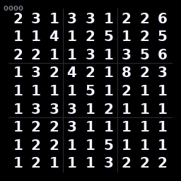
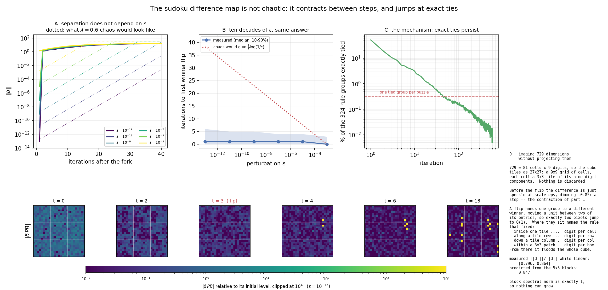

# Solving Sudoku using iterated projections

## Update Sept 2026

- Updated to use recent plotting API
- Documented the 5 projections in the original code
- Replaced argsort with argmax; same behavior
- Fixed projection 5 to hard-set the clues in the puzzle; original ORed the state with the clues, which made the algorithm converge, but sometimes at the cost of *changing the clues*. 
- Ported (with Claude) the algorithm to pytorch, with an approx 500x batch-mode speedup. 

Notes: 

1. The algorithm needs approx 8000 iterations on sudoku-extreme puzzles to solve 53% of the puzzles.  Message passing with the exact Hungarian Algorithm achieves (~52%) after 500 iterations; the Hungarian algorithm is use to solve the exact matching problem (which digits to match to which states) for the 4 different Sudoku rules under iterated belief states. 
2. This algorithm, like many that only look at single constraints at a time, tends to settle into local minima & oscillate with ~1 rule conflict there.  
 
  - In comparison, CaDiCaL solves **all** 422784 puzzles in 35 sec on my semi-old workstation.  Never gets stuck.  ~10x faster than the GPU-accelerated version. 

# How it works

Gif of the algorithm succeeding: 

## Alternating Projections

Projections onto convex sets (POCS) is a useful method for finding the intersection between convex sets.  A simple example is shown below, where we have two convex constraint sets $C_1$ (red) and $C_2$ (blue).  The intersection is found by simply projecting onto each set consecutively via the iterated map:

$$\Large x_{n+1} = P_2(P_1(x_n))$$

where $P$ are the projections onto their respective sets.  Projections are idempotent $PP = P$ and are distance minimizing;

$$\Large P(x) = y \in C \text{ such that } \parallel x - y \parallel \text{ is minimized.}$$

The solution is found when

$$\Large x \in C_1 \cap C_2$$

The convexivity of the constraints sets allows lots of general conclusions to be drawn, even if there is little knowledge about the individual sets.  Unfortunately, when the constraint sets are non-convex, very few general results hold. Consequently, rather than finding the global solution, using simple alternating projections can result in stagnation at local minima.  An example of this is shown below, where the sets from the previous example are made to be non-convex, and the ability to find the intersection (global minima) is now highly dependent on the initial guess.

Despite the loss of guarantees when the sets are no longer convex, projection methods can prove very useful and powerful for finding solutions to non-convex optimization problems.  Examples include Sudoku, the n-queens problem , graph-coloring and phase retrieval.

As I will discuss in the next section, to get projection methods to work with non-convex problems, the simple alternating projection algorithm needs to be modified.

<h2> The Difference Map </h2>

One of the most successful non-convex projection algorithms is the difference map (DM).  It is written as

$$\Large x_{n+1} = x_n + \beta D(x_n)$$

where

$$\Large D(x) = y_1(x) - y_2(x),$$

$$\Large \begin{aligned}
y_1(x) &= P_1[(1+\gamma_2)P_2(x) - \gamma_2 x], \\
y_2(x) &= P_2[(1+\gamma_1)P_1(x) - \gamma_1 x]
\end{aligned}$$

where $y_1$ and $y_2$ are called estimates.
Once a fixed point has been reached,

$$\Large x^{\ast} = x^{\ast} + \beta D(x^{\ast})$$

and this implies the two estimates are equal with a solution;

$$\Large x_{sol} = y_1 = y_2$$

Rather than the form outlined above, a simpler version of the difference map is often used and is given by;

$$\Large D(x_n) = P_1[(2P_2(x_n)-x_n)] - P_2(x_n)$$

This simpler version generally performs well and reduces the number of projections required per iteration.

The same non-convex problem is shown below but now using the DM algorithm.  Rather than getting trapped in the local minima, the algorithm is able to escape, search more of solution space, and finally converge onto a solution.

## Running
Simply run

`python sudoku_dm.py`

to solve one of the predefined puzzles.  The puzzle will be solved and a png of each iteration will be saved to `frames/`, ready to be turned into a movie, e.g.

`convert -delay 10 -loop 0 frames/6-*.png sudoku_dm.gif`

Each digit is colored by how long ago it last changed: a cell that has just flipped is red, and over the next 128 iterations it cools through yellow, green and cyan before washing out to white, so the churn of the search is visible at a glance.  `--cmap` picks the ramp (`cool`, `hsv`, `hot`, or `none` for the old all-white digits) and `--max-age` sets how many steps the cycle lasts.

To solve your own puzzle, pass it as 81 characters read row by row, with `0` (or `.`) for an empty cell:

`python sudoku_dm.py 530070000600195000098000060800060003400803001700020006060000280000419005000080079`

Pass `-` instead to read the puzzle from stdin.  Other useful flags: `-p N` picks a built-in puzzle (1-6), `--no-images` skips the frames, `--seed N` makes a run reproducible, and `-q` silences the per-iteration error.  Run `python sudoku_dm.py --help` for the full list.  Requires `numpy` and `pillow`.  Enjoy.

## Solving a lot of puzzles

`benchmark_dm.py` runs the map over a csv of `puzzle,solution` lines and records, for each one, how many iterations it took, whether it converged, and whether it converged to *that* puzzle's solution -- the solver only checks for a valid grid, so it can settle on a grid that quietly breaks a clue.

`python benchmark_dm.py test-xtrm.csv`

spreads the work over the cores, one puzzle per process.  `--device cuda` uses the batched pytorch port in `sudoku_dm_gpu.py` instead, which marches `--batch-size` puzzles through the difference map in lockstep:

`python benchmark_dm.py test-xtrm.csv --device cuda`

A puzzle is 5x9x9x9 = 3645 floats and every operation in the iteration is elementwise or a reduction over nine values, so the whole thing is memory bound and the batch is what keeps the card busy.  On a 4090 that is about 7800 puzzles/s against about 15/s for the numpy solver across 32 cores.  Bigger batches are not automatically better -- past the point where the state stops fitting in the L2 it gets slower again, so `--batch-size` is worth tuning for the card.

`sudoku_dm_gpu.py` also runs standalone (`python sudoku_dm_gpu.py <81 chars> ...`, or `-` for one puzzle per line on stdin).  It solves only; the animation frames are the numpy solver's job.  Two things differ from `sudoku_dm.py` and are meant to: it makes no attempt at bit-parity, since ties inside a projection group are broken by `torch.argmax` and roughly 99% of the groups are tied on the first iteration, so trajectories diverge immediately; and it reports the number of updates actually applied, where `sudoku_dm.solve()` tests a projection computed before the previous update and so notices a solution one iteration late.  Solve rates and iteration distributions agree.

Requires `torch` in addition to `numpy`.

## Is it chaotic?

(This section was written by Claude)

It looks chaotic -- reorder one floating point operation and a puzzle takes a completely different path to a completely different grid -- but it is not, and `sensitivity_dm.py` works out why.

Between switching events the map is *affine*, and it *contracts*.  The four rule projections return one-hot vectors, so as long as no argmax changes hands they are locally constant and drop out of the derivative; PC5 is constant on the clue cells and the identity elsewhere.  Every entry of the cube then evolves independently of every other -- the only coupling is $PB$, which averages the five copies at the same cube index -- so the Jacobian is block diagonal with 729 blocks of $5 \times 5$, of just two kinds.  Both have singular values $\{1,1,1,1,0\}$ or $\{1,1,1,\tfrac{1}{\sqrt5},\tfrac{1}{\sqrt5}\}$, so the spectral norm is exactly 1 and nothing can grow; for a random perturbation they predict an RMS factor of 0.847 per step.  Measured: 0.796 to 0.864.

What does the damage is that exact ties never go away.  At the random 0/1 start ~98% of the 324 rule groups are exactly tied.  That falls off fast, as the comment in `sudoku_dm.py` says -- but it falls to about 0.3%, not to zero, and 0.3% of 324 is roughly one tied group per puzzle per iteration, forever (panel C).  A tied group is a genuine discontinuity: the two candidates are bitwise equal, the projection is honestly multi-valued, and the winner is a one-hot vector, so whichever way the tie falls the trajectories jump apart by $O(1)$ in one step.

That gives a prediction which separates the two explanations.  Under a Lyapunov exponent $\lambda$ a perturbation grows as $\epsilon e^{\lambda t}$, so the time to separate is $\tfrac{1}{\lambda}\log(1/\epsilon)$ and ten decades of $\epsilon$ would fan the curves ten log-units apart in time.  Under tie-driven switching $\epsilon$ never has to grow at all -- it only has to be nonzero when the next exact tie turns up -- so the separation time should not depend on $\epsilon$ at all.  Measured from $10^{-13}$ to $10^{-3}$, it does not: a median of one step at every scale (panels A and B), with $\|\delta\|/\epsilon$ pinned in the same interval at every $\epsilon$, which is what a linear regime looks like.

So: not chaos, but sensitive dependence by discontinuity.  The practical consequence is the same -- there is no such thing as a small perturbation of this map -- which is why `sudoku_dm_gpu.py` does not try to reproduce the numpy solver's trajectories and only claims to match it in distribution.

Panel D is the answer to "how do you look at 729 dimensions": you don't have to project them.  The cube is 81 cells by 9 digits, so it tiles losslessly as a 27x27 image -- a 9x9 grid of cells, each cell a 3x3 tile of its nine digit components.  A flip moves a unit between two entries of one group, so exactly two pixels jump, and where they sit says which rule fired: inside a single tile is one-digit-per-cell, along a tile row or column is the row or column rule, within a 3x3 patch of tiles is the block rule.

## References

V. Elser, 'Phase retrieval by iterated projections', J. Opt. Soc. Am. A/Vol. 20, No. 1/January 2003

V. Elser, et al. 'Searching with iterated maps' 104 (2), 418-423 (2007)
http://www.pnas.org/content/104/2/418.full.pdf

S. Gravel, V. Elser, "Divide and concur: A general approach to constraint satisfaction". Physical Review E. (2008). 78:036706. http://link.aps.org/doi/10.1103/PhysRevE.78.036706

Luke Russel D, “Relaxed averaged alternating reflections for diffraction imaging” Inverse problems, (2005) 21, 37-50

Bauschke H H, Combettes P L and Luke D R 2003 Hybrid projection–reflection method for phase retrieval
J. Opt. Soc. Am. A 20 1025–34

H.H. Bauschke, P.L. Combettes, and D.R. Luke, "Phase retrieval, error reduction algorithm, and Fienup variants: a view from convex optimization". Journal of the Optical Society of America A. (2002). 19:1334-1345

S. Marchesini, 'A unified evaluation of iterative projection algorithms for phase retrieval',  Review of Scientific Instruments 78 (2007).

